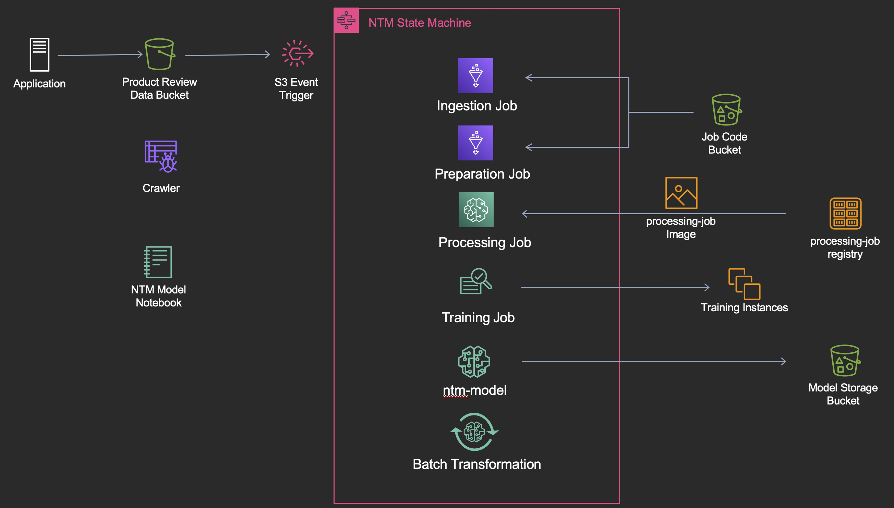

# Topic Modeling Pipeline

For my capstone project during the North American ML Black Belt program, I chose the NLP Topic Modeling problem. The details of the problem space are [here](https://github.com/aws-samples/amazon-sagemaker-architecting-for-ml/blob/master/Writeups/NLP:%20Text%20Classification.md), but I'll summarize them briefly. 


### **Given a dataset of Amazon product reviews, build a topic modeler to categorize negative reviews.**   

There were two phases proposed in the original problem description. The first phase was to use SageMaker to build a topic model for this data. The second phase was to create subcategories from the categories output by the first model. I took a slightly different approach for phase two. Our customers at 1Strategy typically struggle to automate and productionize their workloads. So, for phase two I focussed on automating the entire pipeline and linking each piece together for a seamless and useful modeling workflow.

<p align="center">

</p>

There are two videos, one is the short version I submitted with the capstone and the other is a longer version that goes into more detail about each piece of the workflow. Check the **resources/** folder for the results of the model I ran in the video.

This project is still a work in progress, so there will be additional updates/changes in the future.

There is a recorded demonstration of this project in action here: [Full Workflow Demo](https://youtu.be/RlIiNQy-vNM)

**Deployment:**

1. choose new bucket names in params.ini
2. deploy the *capstone_platform.yml* template
3. create **gluejobs** prefix in the tools bucket
   * upload *data_ingestion.py* and *data_prepare.py* to the **gluejobs** prefix
4. create **raw** prefix in the data bucket
5. create processing-job image and upload
   * run `docker build -t processing-job --build-arg bucket='your-bucket-name' .` when building the image
6. deploy the *capstone_workflow.yml* template
7. upload *amzn_review.csv* data to the **raw** path in the data bucket

*Structure:*
```text
/
├── cloudformation/
│   ├── capstone_platform.yml # base resources for this workflow
│   ├── capstone_workflow.yml # resources that constitute this workflow
│   ├── deploy.sh             # deployment script
│   └── params.ini            # parameters for both CloudFormation templates
├── jobs/
│   ├── data_ingest.py        # ingestion job code
│   ├── data_prepare.py       # preparation job code
│   ├── invocation-lambda/    # future state lambda for an ML endpoint
│   └── process-container/    # processing job container code
├── notebooks/
│   ├── nlp_utils.py          # utility functions
│   └── ntm_model.ipynb       # main workflow notebook
├── resources/
│   ├── imgs/                 # images
│   ├── ntm_workflow.pptx     # short presentation of this workflow
│   └── videos/               # project videos
```  

*Resources:*
* https://docs.aws.amazon.com/step-functions/latest/dg/sample-train-model.html
* https://sagemaker-examples.readthedocs.io/en/latest/introduction_to_applying_machine_learning/ntm_20newsgroups_topic_modeling/ntm_20newsgroups_topic_model.html
* https://github.com/aws/amazon-sagemaker-examples/tree/master/scientific_details_of_algorithms/ntm_topic_modeling

*Issues:*
* GlueJobs cannot return values to the state machine
* SageMaker ProcessingJob required a custom Docker image
* For Synchronous calls to AWS service integrations, roles need CloudWatch Events permissions
* When using GPU instances for SageMaker training jobs, be sure to request a service increase if necessary.

*Improvements:*
* Allow SageMaker notebook to deploy CloudFormation template
* ML
  * Perform topic modeling for positive reviews
  * Compare NTM with LDA
  * Add hyperparameter tuning job
  * Update training instance configurations
  * Concat review title text with review text
  * Make t-SNE plot
* State Machine
  * Clean up JSON passed between states
  * Propagate state machine tags to each resource created in the workflow
  * Add notifications if the state machine fails at any stage
  * Log all steps to same log stream
  * Add a step to check WETC and TU scores before model creation
* Endpoint Approach
  * Create individual lambda layers
  * Simplify Makefile
